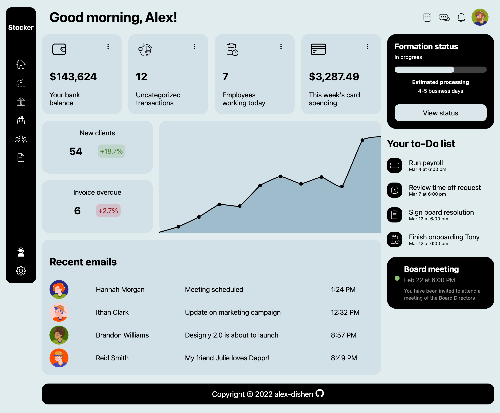

# Admin Dashboard
The **Admin Dashboard** is created according to the assignment from **The Odin Project** [course](https://www.theodinproject.com/paths/full-stack-javascript/courses/intermediate-html-and-css).
 
 

### 🔗 **Live preview** of the project is [here](https://alex-dishen.github.io/admin-dashboard/).

## **Outcome**
* Used **HTML**
* Used **CSS**
* Learned how to better structure CSS code
* Learned how to use SVGs
* Improved CSS Grid styling
* Improved usage of positioning in CSS

## **Navigation**
* See my next project [Library](https://github.com/alex-dishen/library)
* See my previous project [Sign-up Form](https://github.com/alex-dishen/sign-up-form)